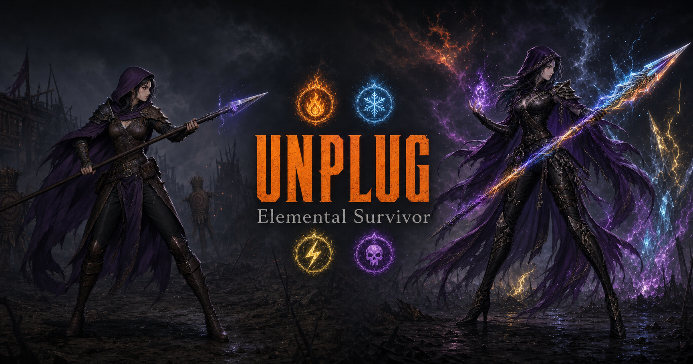

# UNPLUG: Elemental Survivor

> ⚔️ 3D Hack-and-Slash Elemental Survivor — built with Rust WASM + Three.js + AI

🎮 **[PLAY NOW](https://owonie.github.io/unplug/)**



---

## 🎮 About

UNPLUG is a vampire-survivors-style 3D hack-and-slash browser game where you combine elemental orbs to unlock 50 classes, cast gesture-based spells, and survive endless waves of monsters — culminating in multi-phase boss fights.

### Key Features

- 🔮 **4 Elements** — 🔥Fire ❄️Ice ⚡Thunder ☠️Poison
- ⭐ **50 Classes** — Pure / Hybrid / Triple / Quad / Hidden
- 🖱️ **Gesture Spellcasting** — Drag outward = attack, inward = shield, circle = ultimate
- 💨 **Element-Specific Dash** — Blink / Skate / Triple / Smoke
- 👹 **9 Enemy Types** — Skeleton, Golem, Imp, Wraith, Swarm, Archer, Brute, Elite, Boss
- 💀 **Boss Fights** — 3-phase bosses every 10 waves with arena clearing
- 🎸 **Action Rock BGM** — 4 royalty-free tracks
- 🔊 **16 SFX** — Real mp3 impact sounds

### Controls

| Input | Action |
|-------|--------|
| WASD | Move |
| Space | Dash (element-specific) |
| Left-click drag outward | Directional attack (breath/bolt) |
| Left-click drag inward | Shield (absorb → explode) |
| Left-click draw circle | Ultimate (340°+ required) |
| Right-click drag (2nd class) | Advanced skill (heavier) |
| Right-click circle (2nd class) | Advanced ultimate |
| 1/2/3 | Level-up choice |
| ESC | Pause + skill info |
| 🎵 NEXT | Change BGM |

---

## 🛠️ Tech Stack

| Layer | Tech | Role |
|-------|------|------|
| Game Logic | **Rust → WASM** | Physics, combat, skills, AI, spawning |
| Rendering | **Three.js** | 3D scene, particles, VFX |
| Character | **2D Sprite Billboard** | Recolored Huntress sprite |
| Sound | **MP3 Audio Pool** | 4 BGM + 16 SFX |
| Build | **wasm-pack + Vite** | Bundle + HMR |
| Deploy | **GitHub Pages** | Static hosting |

### Architecture

```
┌─────────────────────────────────────┐
│           Browser (Client)           │
├──────────┬──────────┬───────────────┤
│ Three.js │ HTML/CSS │  MP3 Audio    │
│ Renderer │   UI     │   Sound       │
├──────────┴──────────┴───────────────┤
│         JavaScript Bridge            │
├─────────────────────────────────────┤
│       Rust WASM Game Engine          │
│  ┌─────┬───────┬──────┬──────────┐  │
│  │World│Player │Enemy │Class/Skill│  │
│  │     │       │(9종) │(50/150)  │  │
│  └─────┴───────┴──────┴──────────┘  │
└─────────────────────────────────────┘
```

---

## ⚔️ Game Systems

### Class Promotion (전직)

| Tier | Requirement | Unlock |
|------|-------------|--------|
| 1st | Lv3 + 2 orbs | Element skills + dash |
| 2nd | Lv5 + 5 orbs | Right-click advanced skills |
| 3rd | Lv8 + 8 orbs | Ultimate upgrades |

### Skill System

| Gesture | Left-Click (1st) | Right-Click (2nd) |
|---------|------------------|-------------------|
| Outward drag | Cloud breath (range 8, 200° cone) | Pillar/Lance/Beam/Shockwave (range 9) |
| Inward drag | Shield (40% HP absorb → 5s explode) | Shield |
| Circle | Ultimate (range 14, 5×ATK) | Advanced Ultimate (12 range, 3× more particles) |

### Enemy Waves

- Wave 1-3: Easy start (skeletons → imps → swarm)
- Wave 4-6: Mixed (archers, brutes join)
- Wave 5/15/25: **Elite mini-boss** (leap attack, 300+ HP)
- Wave 7-9: Mass swarm rushes
- Wave 10/20/30: **BOSS** (3 phases, arena cleared, dedicated duel)

---

## 🤖 AI-Assisted Development

This project was built **entirely with AI (Claude) as development partner** — from concept to deployment.

| Phase | AI Role | Output |
|-------|---------|--------|
| Design | Game concept, 50-class balance table, skill system | 150 skills across 50 classes |
| Engine | Rust WASM game engine (2000+ lines) | Physics, combat, spawning, AI |
| Rendering | Three.js renderer (1200+ lines) | VFX, particles, camera |
| Sound | SFX system + BGM integration | 16 mp3 effects + 4 tracks |
| Polish | Hit feel, screen shake, promotions | Kill freeze, flash, ceremonies |
| Debug | Stack overflow, OOM, build issues | 20+ hotfixes |

---

## 📦 Build & Run

```bash
# Prerequisites: Rust, wasm-pack, Node.js

# Build WASM
cd crate && wasm-pack build --target web --out-dir ../web/pkg

# Dev server
cd web && npx vite --host --port 3000

# Production build (→ docs/)
cd web && npx vite build

# Deploy (GitHub Pages from docs/)
git add -A && git commit -m "deploy" && git push
```

---

## 📄 License

Game assets (sprites, BGM, SFX) are royalty-free from Pixabay/Freesound.  
Code is open for educational purposes.

---

Made by **owon** | [GitHub](https://github.com/owonie) | [LinkedIn](https://linkedin.com/in/owonie)

---

# UNPLUG: 원소 서바이버 (한글)

> ⚔️ 3D 핵앤슬래시 원소 서바이버 — Rust WASM + Three.js + AI 협업 개발

🎮 **[플레이하기](https://owonie.github.io/unplug/)**

---

## 게임 소개

UNPLUG는 뱀파이어 서바이버 스타일의 3D 핵앤슬래시 브라우저 게임입니다.  
원소 오브를 모아 50개 직업 중 하나로 전직하고, 제스처로 스킬을 시전하며, 끝없는 웨이브와 보스를 처치하세요.

### 핵심 특징

- 🔮 **4원소 조합** — 🔥화염 ❄️빙결 ⚡번개 ☠️맹독
- ⭐ **50개 직업** — 순수/하이브리드/3원소/4원소/히든
- 🖱️ **제스처 스킬** — 바깥 드래그=방향공격, 안쪽=쉴드, 원=궁극기
- 💨 **원소별 대쉬** — 순간이동/가속/3연속/연막
- 👹 **9종 적** — 졸개, 탱크, 돌격, 유령, 벌레떼, 궁수, 돌격병, 엘리트, 보스
- 💀 **보스전** — 10웨이브마다 3페이즈 보스 (필드 소거 → 1:1 결투)
- 🎸 **액션 록 BGM** — 4트랙 로열티프리
- 🔊 **16종 효과음** — 실제 mp3 임팩트

### 조작법

| 입력 | 동작 |
|------|------|
| WASD | 이동 |
| Space | 대쉬 (원소별 고유) |
| 좌클릭 드래그 바깥 | 방향 공격 (브레스/볼트) |
| 좌클릭 드래그 안쪽 | 쉴드 (흡수 → 5초 후 폭발) |
| 좌클릭 원 그리기 | 궁극기 (340°+ 필요) |
| 우클릭 (2차 전직 후) | 강화 스킬 |
| 1/2/3 | 레벨업 선택 |
| ESC | 일시정지 |

---

## 전직 시스템

| 단계 | 조건 | 해금 |
|------|------|------|
| 1차 전직 | Lv3 + 오브 2개 | 원소 스킬 + 대쉬 |
| 2차 전직 | Lv5 + 오브 5개 | 우클릭 강화 스킬 |
| 3차 전직 | Lv8 + 오브 8개 | 궁극기 강화 |

💡 **팁**: 레벨업 시 원소 오브를 우선 선택하면 빠르게 전직할 수 있습니다!

---

## 기술 스택

| 레이어 | 기술 | 역할 |
|--------|------|------|
| 게임 로직 | **Rust → WASM** | 물리, 전투, 스킬, AI |
| 렌더링 | **Three.js** | 3D 씬, 파티클, VFX |
| 캐릭터 | **2D 스프라이트** | 리컬러링 (보라 망토) |
| 사운드 | **MP3 오디오 풀** | BGM 4곡 + SFX 16종 |
| 빌드 | **wasm-pack + Vite** | 번들링 |
| 배포 | **GitHub Pages** | 정적 호스팅 |

---

## AI 활용 과정

이 프로젝트는 **AI(Claude)를 핵심 개발 파트너로 활용**하여 기획부터 배포까지 전 과정을 진행했습니다.

| 단계 | AI 역할 | 산출물 |
|------|---------|--------|
| 기획 | 게임 컨셉, 50직업 밸런스 | 150개 스킬 설계 |
| 엔진 | Rust WASM 게임 엔진 | 2000+ lines |
| 렌더링 | Three.js VFX 시스템 | 파티클, 카메라, 이펙트 |
| 사운드 | SFX/BGM 통합 | 16종 mp3 + 4트랙 |
| 폴리싱 | 타격감, 연출 | 히트스톱, 전직 연출, 보스 등장 |
| 디버그 | OOM, 재귀, 빌드 | 20+ 핫픽스 |

---

## 빌드 방법

```bash
# Rust + wasm-pack + Node.js 필요

cd crate && wasm-pack build --target web --out-dir ../web/pkg
cd web && npx vite build
git push  # GitHub Pages 자동 배포
```

---

Made by **owon** | [GitHub](https://github.com/owonie) | [LinkedIn](https://linkedin.com/in/owonie)
